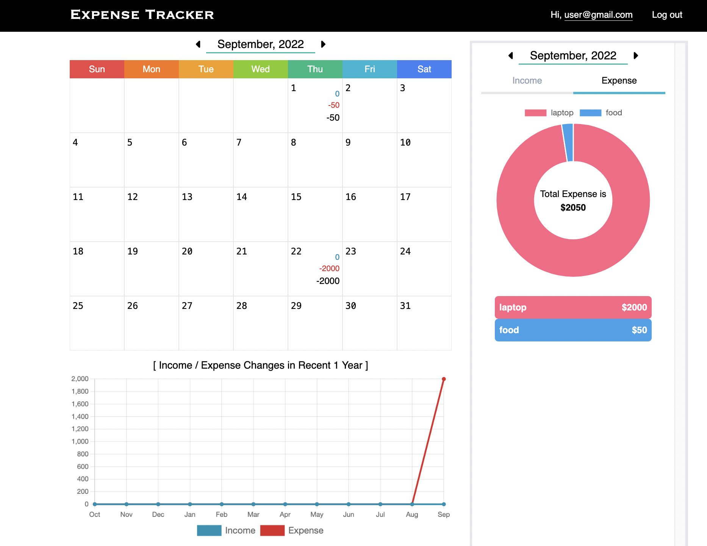
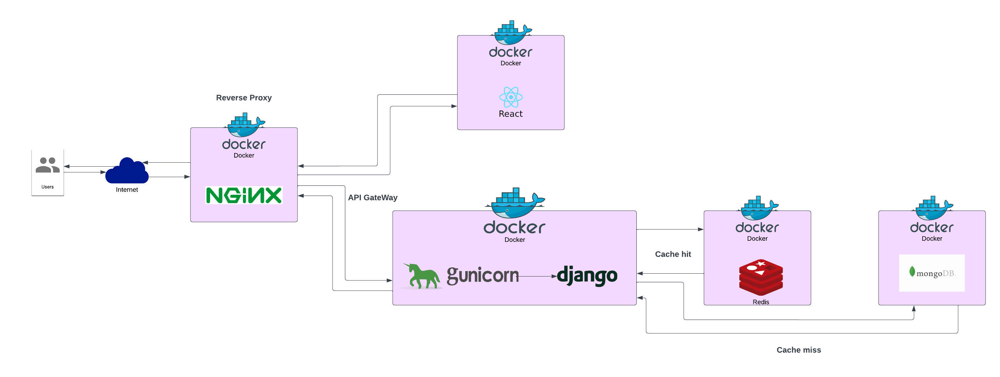

# expense-tracker



<br>

# Architecture



<br>

# What We learned

The app was developed for learning purposes.
If you have any suggestions or reviews, please message me!
I want to learn more about how to design the architecture optimally and how code can be improved!

### frontend repo

- https://github.com/yk-jp/expense-tracker-frontend

### backend repo

- https://github.com/yk-jp/expense-tracker-backend

# Setup for local development

clone the repo
```
git clone git@github.com:yk-jp/expense-tracker.git
```

move to the root dir
```
cd expense-tracker
```

run a docker file

```
make run
```

You can see collections in mongodb database at 
```
localhost:27018
```

open 
 ```
 http://localhost:3000
 ```

<br>

# Project Member

### Frontend

- @https://github.com/yk-jp
- @https://github.com/Tomo-ja

### Backend

- @https://github.com/yk-jp

# Tech Stack

### Frontend

- HTML
- CSS
- Sass
- React.js
- Docker

### Backend

- Python
- Django
- Redis
- MongoDB
- Docker
- Gunicorn
- Nginx

### Deployment

- AWS EC2

### Testing

- Postman
