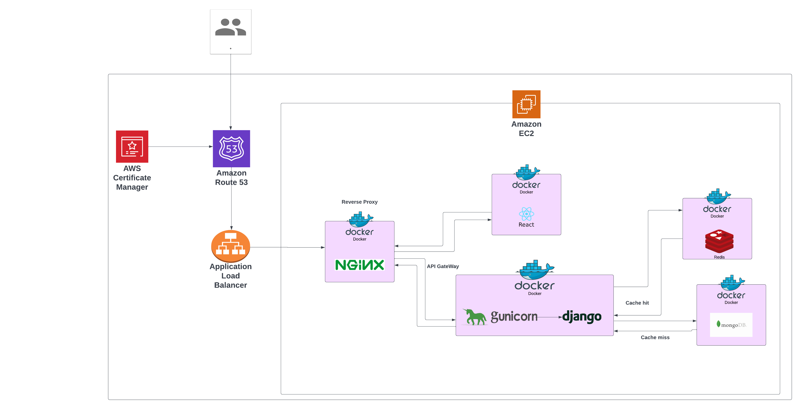

# expense-tracker


<br>

# Architecture



<br>

# What I learned (@https://github.com/yk-jp)
1. How nginx serves static contents and plays a role as API Gateway
2. Why databases in docker are not generally recommended for production(I used the dockerized database for production to make configuration simpler)
3. Why we need a WSGI HTTP Server
4. How to optimize docker image size
5. Deployment process using AWS

The app was developed for learning purposes.
If you have any suggestions or reviews, please message me!
I want to learn more about how to design the architecture optimally and how code can be improved!

### frontend repo

- https://github.com/yk-jp/expense-tracker-frontend

### backend repo

- https://github.com/yk-jp/expense-tracker-backend

# Setup for local development

clone the repo
```
git clone git@github.com:yk-jp/expense-tracker.git
```

move to the root dir
```
cd expense-tracker
```

Before running a docker compose, 
go to the frontend and backend repos, updating `.env.tmplate` and `.env.template.docker` to `.env` for each.

run a docker file in a root dir(`expense-tracker`)

```
make run
```

You can see collections in mongodb database at 
```
localhost:27018
```

open 
 ```
 http://localhost:3000
 ```

<br>

# Project Member

### Frontend

- @https://github.com/yk-jp
- @https://github.com/Tomo-ja

### Backend

- @https://github.com/yk-jp

# Tech Stack

### Frontend

- HTML
- CSS
- Sass
- React.js
- Docker

### Backend

- Python
- Django
- Redis
- MongoDB
- Docker
- Gunicorn
- Nginx

### Deployment

- AWS EC2

### Testing

- Postman
